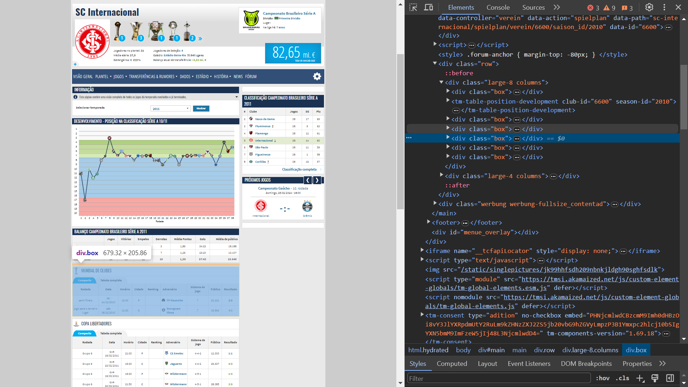
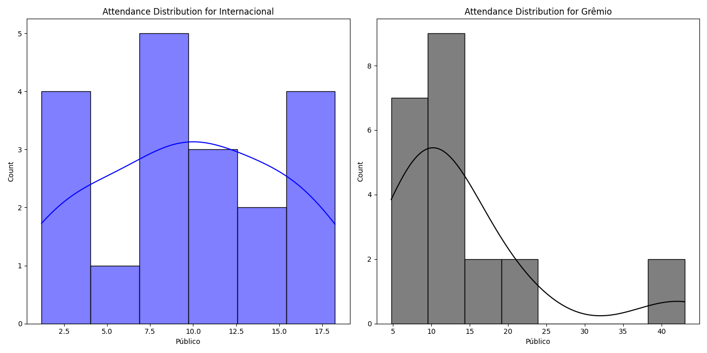

# Análise das Cifras de Público dos Jogos em Casa de Internacional e Grêmio

---

## Introdução

Este estudo visa `comparar os números de público em jogos em casa de dois proeminentes times de futebol brasileiros, Internacional e Grêmio`. Entender o engajamento dos fãs em termos de público pode oferecer compreensões sobre a popularidade local das equipes e a eficácia de suas estratégias de marketing. Dada a natureza não paramétrica dos dados de público, o `Teste U de Mann-Whitney`, um teste de significância estatística não paramétrico, `foi escolhido para análise`.

---

## Coleta de Dados

Os dados consistem em cifras de público para `jogos em casa` de Internacional e Grêmio, abrangendo `vários anos do campeonato Campeonato Gaúcho`. Os conjuntos de dados foram extraídos via `scraping do site TransferMarket` e estruturados em formato CSV, com cada arquivo correspondendo a um ano de partidas para uma equipe.

---

---

## Metodologia

### Preparação dos Dados

Cada arquivo CSV foi carregado em um DataFrame do Pandas usando Python, focando na coluna 'Público' para as cifras de público e 'Cidade' para `filtrar por jogos em casa`. Entradas marcadas com 'x' foram excluídas da análise para levar em conta os anos da pandemia de COVID-19, quando o público foi restrito.

### Análise Exploratória de Dados (EDA)

Antes dos testes de hipóteses, foi realizada uma EDA para `visualizar a distribuição das cifras` de público para ambas as equipes usando histogramas. Esta etapa garantiu que os dados fossem apropriadamente processados e adequados para o Teste U de Mann-Whitney.

---

### Distribuição de Públicos

---

## Testes Estatísticos

O Teste U de Mann-Whitney foi aplicado às cifras de público para avaliar se havia uma diferença estatisticamente significativa na mediana de público entre Internacional e Grêmio.

### Seleção do Teste Estatístico

`O Teste U de Mann-Whitney foi escolhido para esta análise devido à natureza não paramétrica e independência assumida dos dados de público.` Diferente dos testes paramétricos, que assumem uma distribuição normal dos dados, os testes não paramétricos não requerem tais suposições, tornando-os mais adequados para dados que podem não seguir uma distribuição normal.

---

## Hipóteses
$H_0$: não há diferença significativa, $H_a$: há diferença significativa;

## Resultados

Os histogramas revelaram as distribuições de público para ambas as equipes, sem diferenças significativas aparentes. O Teste U de Mann-Whitney resultou em uma `estatística U de 165,5` e um `valor-p de aproximadamente 0,261.` Este valor-p está acima do `limiar convencional de 0,05`, indicando nenhuma diferença significativa nas cifras medianas de público entre os jogos em casa das duas equipes nos anos considerados.

---

## Conclusão

A análise `sugere que não há diferença estatisticamente significativa nas cifras de público para Internacional e Grêmio durante os anos considerados`, excluindo os anos de pandemia. Este achado indica um nível similar de engajamento dos fãs em termos de público para ambas as equipes. Pesquisas futuras poderiam expandir isso, incorporando fatores adicionais como desempenho da equipe, condições climáticas e variáveis econômicas para entender melhor a dinâmica do público nos jogos.

---

Apresentado por `Vitor Lemos`
Data: `15/fev/2024`
